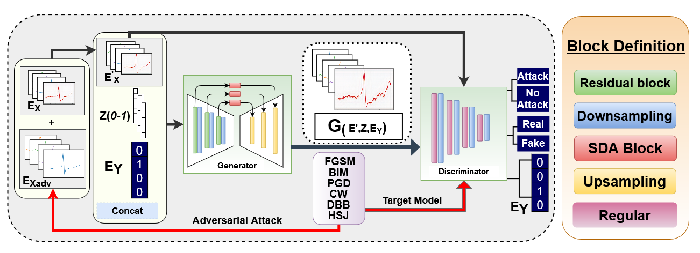
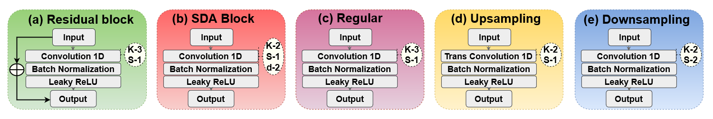
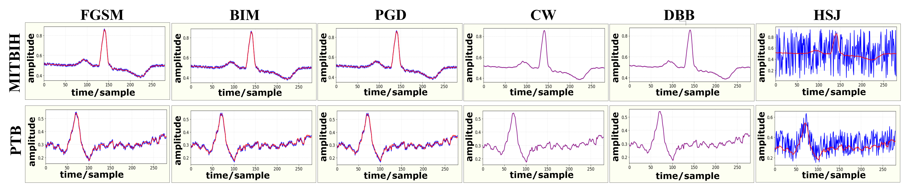

[](LICENSE)
[](https://arxiv.org/abs/2110.09983)
[](https://link.springer.com/chapter/10.1007/978-3-031-17721-7_8)

# \[MICCAI-AMAI 2022\] ECG-ATK-GAN: Robustness against Adversarial Attacks on ECGs using Conditional Generative Adversarial Networks


Official PyTorch implementation of \[MICCAI-AMAI 2022\] [**ECG-ATK-GAN: Robustness against Adversarial Attacks on ECGs using Conditional Generative Adversarial Networks**](https://arxiv.org/abs/2110.09983).

\[[Paper](https://arxiv.org/abs/2110.09983)\]\[[BibTex](#citing-ECG-ATK-GAN)\]

<br clear="left"/>

---

## Abstract
Our proposed Conditional Generative Adversarial Network (GAN) represents a significant advancement in the field of arrhythmia detection from ECG signals, addressing critical issues of robustness and security. By integrating a novel class-weighted objective function for identifying adversarial perturbations and incorporating specialized blocks for discerning and combining out-of-distribution shifts in signals, our architecture stands as the first of its kind to withstand adversarial attacks while maintaining high accuracy in classification. Through extensive benchmarking against six different white and black-box attacks, our model showcases superior robustness compared to existing arrhythmia classification models. Tested on two publicly available ECG arrhythmia datasets, our model consistently demonstrates its ability to accurately classify various arrhythmia types, even under adversarial conditions. This groundbreaking approach enhances the reliability of automated arrhythmia detection systems and addresses security concerns associated with the potential misuse of adversarial attacks in medical contexts.

<div align="left">
  
</div>
<div align="left">
  
</div>

## Training


## Results
### Visualize-Output:
The non-attacked and attacked signals (white and black-box attacks) overlapped, signified by Red and Blue lines.
<div align="left">
  
</div>


## Citing SwinFSR

If you find this repository useful, please consider giving a star and citation:

#### MICCAI 2023 Reference:
```bibtex
@inproceedings{hossain2022ecg,
  title={ECG-ATK-GAN: Robustness Against Adversarial Attacks on ECGs Using Conditional Generative Adversarial Networks},
  author={Hossain, Khondker Fariha and Kamran, Sharif Amit and Tavakkoli, Alireza and Ma, Xingjun},
  booktitle={International Workshop on Applications of Medical AI},
  pages={68--78},
  year={2022},
  organization={Springer}
}
```

#### ArXiv Reference:
```bibtex
@article{fariha2021ecg,
  title={ECG-ATK-GAN: Robustness against Adversarial Attacks on ECGs using Conditional Generative Adversarial Networks},
  author={Fariha Hossain, Khondker and Amit Kamran, Sharif and Tavakkoli, Alireza and Ma, Xingjun},
  journal={arXiv e-prints},
  pages={arXiv--2110},
  year={2021}
}
```
